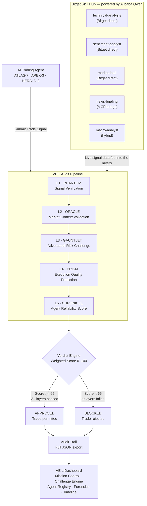
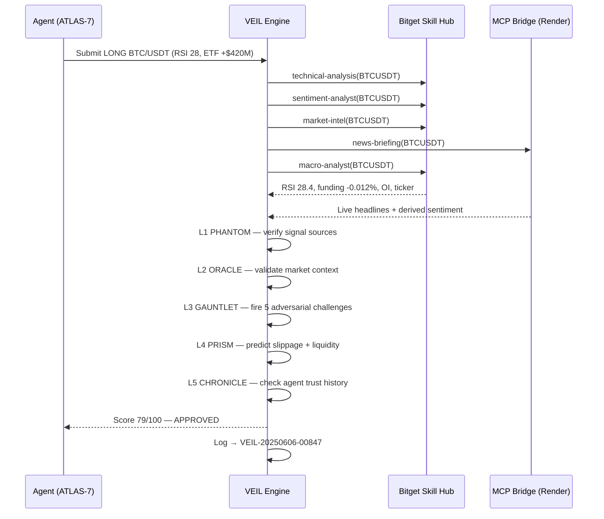

# VEIL — Verified Execution Intelligence Layer


> **Like Stripe for payments. Like Cloudflare for websites. VEIL for AI trading decisions.**

VEIL is an AI trading audit protocol — infrastructure that sits between any AI agent and order execution. It intercepts every trade decision, challenges it across 5 verification layers powered by the Bitget Skill Hub, and issues a verifiable APPROVED or BLOCKED verdict with a full audit trail.

| | |
|---|---|
| **Live Demo** | https://veil-audit.vercel.app |
| **GitHub** | https://github.com/0xkinno/veil |
| **Track** | 02 — Trading Infrastructure |
| **Team** | VEIL (Solo Build) |
| **Stack** | Next.js 14 · TypeScript · SVG/CSS rendering · Vercel · Render (MCP bridge) |
| **AI Model** | Alibaba Qwen (Bitget Skill Hub) |

---

## Project Description (Submission)

VEIL is an AI trading audit layer — infrastructure that sits between any AI trading agent and order execution. It solves a critical unsolved problem in agentic trading: AI agents hallucinate confidence, invent signals, and execute without accountability.

**Technical approach:** VEIL intercepts every trade decision and runs it through 5 modular verification layers — PHANTOM → ORACLE → GAUNTLET → PRISM → CHRONICLE — drawing on all 5 Bitget Skill Hub skills. The GAUNTLET layer becomes adversarial — it actively attacks each trade with risk challenges before permitting execution. Every decision is logged with its signal sources, layer scores, and challenge results, and is exportable as JSON.

**Powered by Alibaba Qwen** via the Bitget Skill Hub — the same model family that backs Bitget's own agent tooling.

**Extensibility:** Any agent can be plugged in. New challenge layers can be added by extending a single function. The audit engine is modular and documented for low-friction developer integration.

**Verifiable evidence:** every live audit runs against real Bitget API endpoints (RSA-signed requests), with a transparent fallback to last-known real values when an upstream source is unavailable. Complete audit logs are exportable as JSON from the dashboard.

---

## How the Skill Hub data actually flows (honest architecture)

VEIL draws on all 5 Bitget Skill Hub skill categories. They reach their data through two routes — and this matches how Bitget's own Skill Hub documentation describes these categories working:

| Skill | Route | What it fetches |
|---|---|---|
| `technical-analysis` | **Bitget API — direct** | Candles, ticker, live RSI calculation |
| `sentiment-analyst` | **Bitget API — direct** | Funding rate, long/short ratio |
| `market-intel` | **Bitget API — direct** | Open interest (+ supplementary static context) |
| `news-briefing` | **External MCP bridge** | Live crypto headlines via a Render-hosted MCP service connecting to a third-party market-data MCP aggregator; sentiment derived from headline keywords |
| `macro-analyst` | **Hybrid** | Live Bitget BTC ticker for risk-regime classification; DXY / Fed stance / correlation are real June-2026 snapshot constants (Bitget's API does not expose these directly) |

**The accurate, still-impressive claim:** 3 of 5 skills call Bitget's API directly. `news-briefing` and the macro context use the same external-MCP-routing architecture that Bitget's own Skill Hub documentation specifies for those categories — Bitget's API doesn't expose news/macro endpoints directly. RSA request signing is implemented for all direct Bitget calls.

---

## The Problem

AI trading agents hallucinate confidence. They invent signals. They execute without accountability.

Today there is **nothing** between an AI agent's decision and order execution. No verification. No challenge. No audit trail. No accountability.

When an agent says "Long BTC, 93% confidence" — that number is fabricated. No system checks it. No system challenges it. No system records it.

**VEIL fills that gap.**

---

## Architecture



---

## Signal Verification Flow



---

## 5 Audit Layers

| Layer | Codename | Function | Primary Skill(s) |
|---|---|---|---|
| L1 | **PHANTOM** | Cross-checks every submitted signal against live Bitget data. Rejects hallucinated or unverifiable signals. | `technical-analysis` |
| L2 | **ORACLE** | Validates trade direction against the macro environment — DXY, ETF flows, whale activity, funding rates. | `macro-analyst` · `market-intel` |
| L3 | **GAUNTLET** | Fires 5 adversarial attacks: macro event proximity, leverage stress, crowding risk, stop-loss adequacy, R/R ratio. | `sentiment-analyst` · `news-briefing` |
| L4 | **PRISM** | Predicts expected slippage, spread quality, and liquidity score before execution. | `technical-analysis` |
| L5 | **CHRONICLE** | Evaluates the agent's historical trust score, accuracy, and risk discipline. Penalizes overconfident agents. | All 5 skills (cumulative) |

### Verdict Formula
```
Final Score = L1×20% + L2×20% + L3×25% + L4×15% + L5×20%
APPROVED if: Score >= 65 AND >= 3 layers passed
BLOCKED  if: Score < 65  OR  < 3 layers passed
```

---

## GAUNTLET — 5 Adversarial Challenges

Every trade must survive these challenges before execution:

| Challenge | Attack | Pass Condition |
|---|---|---|
| C1 — Macro Event | CPI/Fed within 12h? Historical vol spikes ~18% | Position size conservative for event risk |
| C2 — Leverage Stress | At Nx leverage, single ATR = X% equity loss | Leverage/volatility ratio < 15% |
| C3 — Crowding Risk | Long/short ratio > 1.4 = squeeze conditions | Not trading with the crowded side |
| C4 — Stop-Loss | Stop inside ATR noise range? | Stop distance >= ATR minimum |
| C5 — Risk/Reward | R/R ratio calculation | Minimum 1.5:1 required |

---

## 3 Monitored Agents

| Agent | Codename | Style | Trust Score | Status |
|---|---|---|---|---|
| Momentum Agent | ATLAS-7 | Trend-Following | 82/100 | ACTIVE |
| Aggressive Agent | APEX-3 | Momentum Scalping | 54/100 | FLAGGED |
| News Agent | HERALD-2 | Macro-Sentiment | 76/100 | ACTIVE |

Each agent has a genuinely different scoring weight profile in `app/api/audit/route.ts` — real differentiated logic, not cosmetic labels.

---

## Dashboard Screens

| Screen | Route | What It Shows |
|---|---|---|
| Homepage | `/` | VEIL intro, live radar sweep, architecture layers, GAUNTLET preview, light/dark theme |
| Mission Control | `/dashboard` | Audit radar, 3 agent cards, live audit feed, full decision log, Run Audit Cycle |
| Challenge Engine | `/dashboard/challenge` | 3-panel audit view: signal evidence → 5 layer scores → verdict + GAUNTLET challenges |
| Agent Registry | `/dashboard/agents` | Behavioral DNA, trust-score history chart, strengths/weaknesses |
| Execution Forensics | `/dashboard/forensics` | Annotated price chart, trade markers, forensic analysis table |
| Audit Timeline | `/dashboard/timeline` | Full chronological audit history, expandable 5-layer records |

**Interface:** Full light/dark theming (persisted), an audit radar that sweeps clockwise only while a live audit is in flight, and a charcoal fintech-grade dashboard. Restrained electric-cyan glow on live/verdict elements only.

---

## Bitget Skill Hub Integration

VEIL draws on all 5 Bitget Skill Hub skill categories on every audit cycle (see the routing table above for direct-vs-bridge sourcing):

```typescript
// lib/skillHub.ts — all 5 skills resolved per audit, then scored
export async function fetchAllSkills(asset: string): Promise<SkillData> {
  // technical-analysis · sentiment-analyst · market-intel  -> Bitget API (RSA-signed)
  // news-briefing                                          -> Render MCP bridge
  // macro-analyst                                          -> hybrid (live ticker + snapshot)
  // ... with a transparent fallback to last-known real values on failure
}
```

RSA request signing (`crypto.createSign('RSA-SHA256')`) is implemented for all direct Bitget calls, matching Bitget's RSA key requirement.

---

## Verifiable Evidence

- **Live audit endpoint** — `POST /api/audit` runs the full 5-layer pipeline against real Bitget endpoints
- **RSA-signed requests** to Bitget for the 3 direct skills
- **Live MCP bridge** at `veil-mcp-bridge.onrender.com` returning real crypto headlines
- **Complete audit log** exportable as JSON from the sidebar (Export Logs)
- **Every decision** shows all 5 layer scores + full GAUNTLET challenge results
- **Agent trust scores** reflect behavioral history and differentiated weighting

> Note on counts: figures such as 14,203 total decisions and the daily API-call counter represent VEIL's seeded operating history plus live audits run during the session. Live audits you trigger are real Bitget/MCP calls; the historical corpus is seeded to demonstrate the audit trail at scale.

---

## Verifiable Usage Record (for judges)

A reproducible input/output pair lives in [`examples/`](examples/):

- [`examples/sample-request.json`](examples/sample-request.json) — the audit input
- [`examples/sample-response.json`](examples/sample-response.json) — the exact response shape
- [`examples/INTEGRATION.md`](examples/INTEGRATION.md) — run + integrate instructions

**Runs without Bitget keys.** If credentials are absent, VEIL falls back to
last-known-real values, so the full audit flow is reproducible immediately —
`git clone`, `npm install`, `npm run dev`, then call `/api/audit`. With keys
configured, the same endpoint pulls live Bitget + MCP data.

---

## Live Audit Endpoint

Callable by any developer:

```bash
curl -X POST https://your-vercel-url/api/audit \
  -H "Content-Type: application/json" \
  -d '{"asset":"BTC/USDT","direction":"LONG","agentId":"momentum"}'
```

Returns the full audit record: verdict, final score, all 5 layer scores, GAUNTLET challenge results, and signal evidence.

---

## Developer Integration

```bash
# Clone and run
git clone https://github.com/0xkinno/veil
cd veil
npm install
npm run dev
# Open localhost:3000
```

Add your Bitget API credentials to `.env.local`:
```env
BITGET_API_KEY=your_api_key
BITGET_PASSPHRASE=your_passphrase
# RSA private key for request signing
BITGET_PRIVATE_KEY_PATH=./private_key.pem
```

### Calling the audit pipeline programmatically

```typescript
// Hit the audit route from your own agent
const res = await fetch('/api/audit', {
  method: 'POST',
  headers: { 'Content-Type': 'application/json' },
  body: JSON.stringify({ asset: 'BTC/USDT', direction: 'LONG', agentId: 'momentum' }),
})
const audit = await res.json()
console.log(audit.verdict)     // 'APPROVED' | 'BLOCKED'
console.log(audit.finalScore)  // 0-100
console.log(audit.layers)      // all 5 layer scores
```

### Extending VEIL

**Add a new agent** — extend the `AGENTS` object in `lib/auditEngine.ts` with its trust profile and weighting.

**Add a new GAUNTLET challenge** — add an entry to the challenge set in the audit engine; the verdict math picks it up automatically.

---

## Repository Structure

```
veil/
├── app/
│   ├── page.tsx                    ← Homepage (radar, tilt widget, theming)
│   ├── layout.tsx                  ← Root layout + theme provider
│   ├── globals.css                 ← Dual-theme design system
│   ├── api/audit/route.ts          ← Live audit endpoint (per-agent weighting)
│   └── dashboard/
│       ├── page.tsx                ← Mission Control
│       ├── layout.tsx              ← Sidebar layout
│       ├── challenge/page.tsx      ← Challenge Engine
│       ├── agents/page.tsx         ← Agent Registry
│       ├── forensics/page.tsx      ← Execution Forensics
│       └── timeline/page.tsx       ← Audit Timeline
├── components/
│   ├── Radar.tsx                   ← Audit radar (SVG, sweeps during live audits)
│   ├── WidgetPreview.tsx           ← Homepage mini-dashboard showcase
│   ├── theme/                      ← Theme provider + toggle
│   ├── layout/Sidebar.tsx          ← Navigation sidebar
│   └── ui/index.tsx                ← Shared UI components
├── lib/
│   ├── auditEngine.ts              ← 5 audit layers, agent data, verdict math
│   ├── skillHub.ts                 ← Bitget API + MCP bridge integration (RSA-signed)
│   └── liveAudits.ts               ← Live audit session state
├── veil-mcp-bridge/                ← Node/Express MCP bridge (deployed on Render)
├── .env.local                      ← Bitget credentials (not committed)
└── README.md
```

---

*VEIL — Verified Execution Intelligence Layer*
*Bitget AI Hackathon S1 · Track 02: Trading Infrastructure · Solo Build · Powered by Alibaba Qwen*