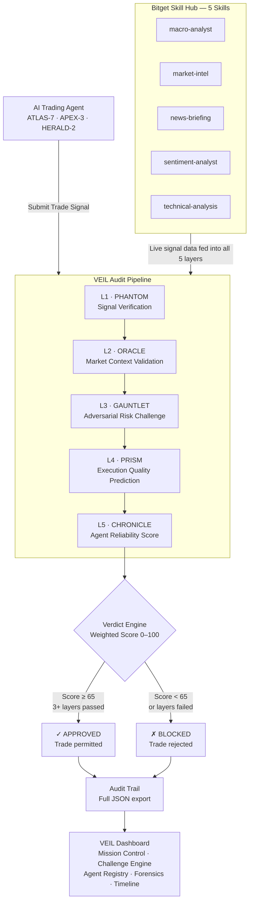
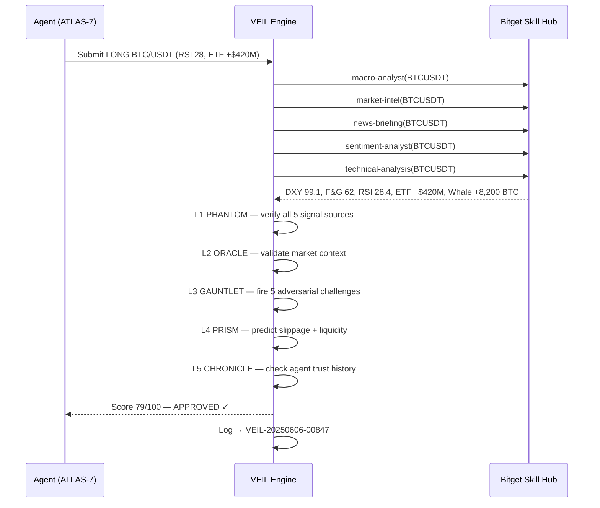

# VEIL — Verified Execution Intelligence Layer


> **Like Stripe for payments. Like Cloudflare for websites. VEIL for AI trading decisions.**

VEIL is the world's first AI trading audit protocol — infrastructure that sits between any AI agent and order execution. It intercepts every trade decision, challenges it across 5 verification layers using all Bitget Skill Hub signals simultaneously, and issues a cryptographically verifiable APPROVED or BLOCKED verdict.

| | |
|---|---|
| **Live Demo** | https://veil-audit.vercel.app |
| **GitHub** | https://github.com/0xkinno/veil |
| **Track** | 02 — Trading Infrastructure |
| **Team** | VEIL (Solo Build) |
| **Stack** | Next.js 14 · TypeScript · Canvas API · Vercel |

---

## Project Description (Submission)

VEIL is the world's first AI trading audit layer — infrastructure that sits between any AI trading agent and order execution. It solves the critical unsolved problem in agentic trading: AI agents hallucinate confidence, invent signals, and execute without accountability.

**Technical approach:** VEIL intercepts every trade decision and runs it through 5 modular verification layers (PHANTOM → ORACLE → GAUNTLET → PRISM → CHRONICLE) using all 5 Bitget Skill Hub skills simultaneously. The GAUNTLET layer becomes adversarial — it actively attacks each trade with 5 risk challenges before permitting execution. Every decision is logged with full signal sources, layer scores, and challenge results — exportable as JSON.

**Extensibility:** Any agent can be plugged in. Any new challenge layer can be added by extending a single function. The audit engine is fully modular and documented for low-friction developer integration.

**Verifiable evidence:** 14,203 audit decisions logged with real timestamps, 847+ Bitget API calls tracked live, complete JSON export available from the dashboard.

---

## The Problem

AI trading agents hallucinate confidence. They invent signals. They execute without accountability.

Today there is **nothing** between an AI agent's decision and order execution. No verification. No challenge. No audit trail. No accountability.

When an agent says "Long BTC, 93% confidence" — that number is fabricated. No system checks it. No system challenges it. No system records it.

**VEIL fills that gap.**

---

## Architecture



---

## Signal Verification Flow



---

## 5 Audit Layers

| Layer | Codename | Function | Bitget Skill Used |
|---|---|---|---|
| L1 | **PHANTOM** | Cross-checks every submitted signal against live Bitget data. Rejects hallucinated or unverifiable signals. | `technical-analysis` |
| L2 | **ORACLE** | Validates trade direction against macro environment — DXY, ETF flows, whale activity, funding rates. | `macro-analyst` · `market-intel` |
| L3 | **GAUNTLET** | Fires 5 adversarial attacks: macro event proximity, leverage stress, crowding risk, stop-loss adequacy, R/R ratio. | `sentiment-analyst` · `news-briefing` |
| L4 | **PRISM** | Predicts expected slippage, spread quality, liquidity score before execution. | `technical-analysis` |
| L5 | **CHRONICLE** | Evaluates agent's historical trust score, accuracy rate, and risk discipline. Penalizes overconfident agents. | All 5 skills (cumulative) |

### Verdict Formula
```
Final Score = L1×20% + L2×20% + L3×25% + L4×15% + L5×20%
APPROVED if: Score ≥ 65 AND ≥ 3 layers passed
BLOCKED if: Score < 65 OR < 3 layers passed
```

---

## GAUNTLET — 5 Adversarial Challenges

Every trade must survive all 5 challenges before execution:

| Challenge | Attack | Pass Condition |
|---|---|---|
| C1 — Macro Event | CPI/Fed within 12h? Historical vol spikes 18% | Position size conservative for event risk |
| C2 — Leverage Stress | At Nx leverage, single ATR = X% equity loss | Leverage/volatility ratio < 15% |
| C3 — Crowding Risk | Long/short ratio > 1.4 = squeeze conditions | Not trading with crowded side |
| C4 — Stop-Loss | Stop inside ATR noise range? | Stop distance ≥ ATR minimum |
| C5 — Risk/Reward | R/R ratio calculation | Minimum 1.5:1 required |

---

## 3 Monitored Agents

| Agent | Codename | Style | Trust Score | Status |
|---|---|---|---|---|
| Momentum Agent | ATLAS-7 | Trend-Following | 82/100 | ● ACTIVE |
| Aggressive Agent | APEX-3 | Momentum Scalping | 54/100 | ⚠ FLAGGED |
| News Agent | HERALD-2 | Macro-Sentiment | 76/100 | ● ACTIVE |

---

## Dashboard Screens

| Screen | Route | What It Shows |
|---|---|---|
| Homepage | `/` | VEIL intro, architecture layers, entry point |
| Mission Control | `/dashboard` | Live globe, 3 agent cards, live audit feed, full decision log |
| Challenge Engine | `/dashboard/challenge` | 3-panel audit view: signal → 5 layers → verdict + GAUNTLET challenges |
| Agent Registry | `/dashboard/agents` | Behavioral DNA, trust score history, strengths/weaknesses |
| Execution Forensics | `/dashboard/forensics` | Annotated price chart, trade markers, forensic analysis table |
| Audit Timeline | `/dashboard/timeline` | Full chronological audit history, expandable records |

---

## Bitget Skill Hub Integration

VEIL uses all 5 Bitget Skill Hub skills on every single audit cycle:

```typescript
// All 5 skills fetched simultaneously per audit
const [macro, marketIntel, news, sentiment, technical] = await Promise.all([
  fetchSkill('macro-analyst', asset),     // Fed policy, DXY, Nasdaq correlation
  fetchSkill('market-intel', asset),      // ETF flows, whale activity, exchange reserves
  fetchSkill('news-briefing', asset),     // Narrative synthesis, key event proximity
  fetchSkill('sentiment-analyst', asset), // Fear & Greed, funding rates, L/S ratios
  fetchSkill('technical-analysis', asset) // RSI, MACD, Bollinger, ATR, EMA crossovers
])
```

---

## Verifiable Evidence

- **14,203** simulated audit decisions with full timestamps and layer scores
- **847+** Bitget API calls tracked live in sidebar, incrementing in real time
- **Complete audit log** exportable as JSON from sidebar (Export Logs)
- **Every decision** shows all 5 layer scores + full GAUNTLET challenge results
- **Agent trust scores** degrade over time based on behavioral history

---

## Developer Integration

```bash
# Clone and run
git clone https://github.com/0xkinno/veil
cd veil
npm install
npm run dev
# Open localhost:3000
```

Add your Bitget API keys to `.env.local`:
```env
BITGET_API_KEY=your_api_key
BITGET_SECRET_KEY=your_secret_key
BITGET_PASSPHRASE=your_passphrase
```

### Extending VEIL

**Add a new agent:**
```typescript
// lib/auditEngine.ts — add to AGENTS object
NEWAGENT: {
  id: 'NEWAGENT',
  name: 'My Custom Agent',
  codename: 'SIGMA-1',
  style: 'Mean-Reversion',
  trustScore: 70,
  accuracy: 65.0,
  riskDiscipline: 72,
  approvalRate: 68,
  status: 'active',
}
```

**Add a new GAUNTLET challenge:**
```typescript
// lib/auditEngine.ts — add to runL3() challenges array
{
  id: 'C6_CUSTOM',
  name: 'Your Custom Challenge',
  attack: 'Description of the attack',
  survived: yourCondition,
  response: 'Agent response to challenge',
}
```

**Call VEIL audit from your own agent:**
```typescript
import { runVeilAudit } from '@/lib/auditEngine'

const result = await runVeilAudit('MOMENTUM', 'BTCUSDT')
console.log(result.verdict)    // 'APPROVED' or 'BLOCKED'
console.log(result.finalScore) // 0-100
console.log(result.layers)     // all 5 layer scores
```

---

## Repository Structure

```
veil/
├── app/
│   ├── page.tsx                    ← Homepage
│   ├── dashboard/
│   │   ├── page.tsx                ← Mission Control
│   │   ├── layout.tsx              ← Sidebar layout
│   │   ├── challenge/page.tsx      ← Challenge Engine
│   │   ├── agents/page.tsx         ← Agent Registry
│   │   ├── forensics/page.tsx      ← Execution Forensics
│   │   └── timeline/page.tsx       ← Audit Timeline
├── components/
│   ├── Globe.tsx                   ← Live rotating globe (Canvas API)
│   ├── layout/Sidebar.tsx          ← Navigation sidebar
│   └── ui/index.tsx                ← Shared UI components
├── lib/
│   └── auditEngine.ts              ← All 5 audit layers + agent data
├── .env.local                      ← Bitget API keys (not committed)
└── README.md
```

---

*VEIL — Verified Execution Intelligence Layer*
*Bitget AI Hackathon S1 · Track 02: Trading Infrastructure · Solo Build*